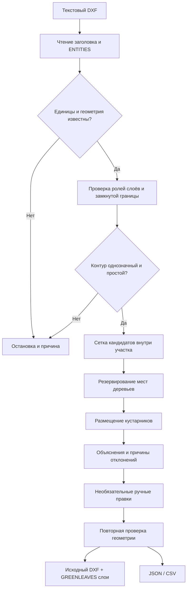

# Архитектура Greenleaves v0.2

Дата: 23.09.2026. Статус: инженерный прототип, не финальная конкурсная версия.

## Компоненты

| Компонент | Путь | Назначение |
|---|---|---|
| Сайт проекта | `site/index.html` | Описание продукта и демонстрация |
| Веб-студия | `site/studio/app.js` | Загрузка DXF, параметры, графика, команды, экспорт |
| Единый алгоритм | `site/studio/engine.js` | Парсер, геометрия, генерация, валидация, DXF |
| CLI | `scripts/cli.mjs` | Тот же расчёт без браузера |
| Справочник | `site/data/species-catalog.json` | 327 партнёрских записей; оригиналы не сверены |
| Локальный сервер | `scripts/serve.mjs` | Только статические файлы, без API |
| Linux-упаковка | `Dockerfile` | Node 22 Alpine, пользователь node, порт 8080 |
| Независимая проверка DXF | `scripts/verify-dxf.py` | ezdxf: открытие, audit, координаты и подписи |

## Поток данных

Схема отражает реализованный алгоритм. Нормативная трассировка к конкретным пунктам НПА пока отсутствует и является обязательной следующей доработкой.

## Геометрия и генерация

1. ASCII/текстовый DXF разбирается на пары group code/value. В браузере и CLI поддержаны UTF-8 и fallback Windows-1251, DXF Unicode escapes.
2. В modelspace обрабатываются LINE, прямые LWPOLYLINE/POLYLINE, POINT, CIRCLE и ARC. TEXT/MTEXT/DIMENSION/ATTRIB не используются как препятствия. Объекты paper space не участвуют в размещении, но сохраняются в исходном DXF.
3. INSERT, XREF через INSERT, HATCH, SPLINE, MPOLYGON, bulge, нестандартная OCS и ненулевая Z останавливают расчёт, если их слой не исключён явно. Исключённый слой фиксируется в отчёте. Само исключение не доказывает безопасность.
4. Только один простой замкнутый контур (до 2000 вершин). Несколько контуров/отверстия требуют подготовки; габаритный прямоугольник не заменяет границу.
5. Расстояние до сегмента вычисляется аналитически. Для площадных препятствий внутри полигона расстояние считается нулевым. CIRCLE считается диском. ARC дискретизируется с консервативным вычитанием максимальной стрелы сегмента.
6. Кандидаты берутся из сетки. Сначала размещаются деревья, затем кустарники. Сценарии меняют долю предпочтительных кандидатов, но не ослабляют ограничения. Максимальный лимит честно маркирует частичное обследование участка.
7. Посадка должна находиться внутри границы с отступом, проходить все буферы и не пересекать условную крону другой посадки. Условные радиусы 3/1,25 м не являются индивидуальными ботаническими моделями.
8. Ручная правка проходит тот же валидатор. Перед DXF-экспортом все размещения проверяются снова.

## Экспорт

Оригинальные DXF-пары сохраняются; в ENTITIES добавляются CIRCLE и TEXT, в таблицу LAYER — отсутствующие слои результата. Новые handles уникальны относительно исходных. Табличный счётчик и HANDSEED обновляются, где применимо. Нелатинские символы пишутся DXF Unicode escapes, чтобы не потерять кириллицу при сохранении старой кодовой страницы. Не выполняется небезопасное склеивание нескольких файлов без переноса ресурсов и блоков.

JSON содержит входной файл, единицы, роли слоёв, настройки, численные допущения, точки, отклонения, журнал правок и ограничения. CLI дополнительно записывает SHA-256 исходных байтов. CSV защищает строковые поля от формульного исполнения при открытии в таблицах.

## Инфраструктура и границы

- Веб-расчёт не передаёт DXF наружу. Единственный fetch приложения загружает статический каталог растений с того же сайта.
- Нет аккаунтов, БД, секретов, внешнего LLM API, телеметрии или загрузки CAD на сервер.
- Нет HTTP API и Swagger: CLI и UI напрямую вызывают engine.js.
- GitHub Pages размещает только `site/` из ветки `gh-pages`. `main` не публикуется автоматически.
- Для локального контура Docker запускает тот же статический сайт. Сборка Docker и тест на МосТех.ОС ещё не выполнены.
- Тестирование парсером ezdxf не заменяет визуальное открытие результата в CAD на целевой ОС.

Инструкции запуска находятся в корневом README. Нормативная логика, климатический профиль, объединение CAD и реальная приёмка перечислены в `ROADMAP.md`.
